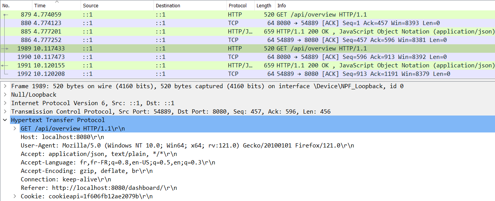
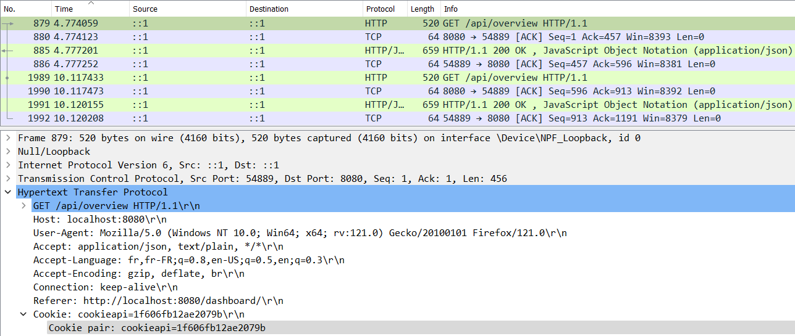
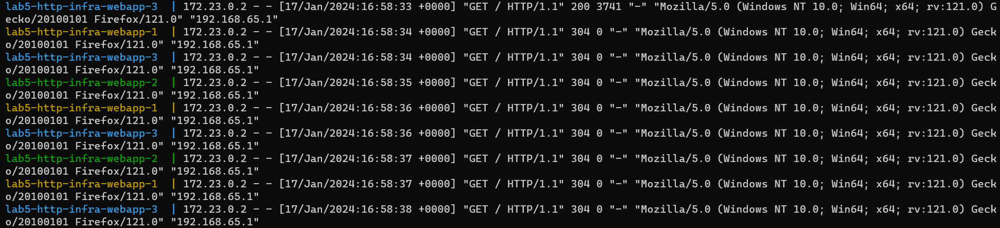
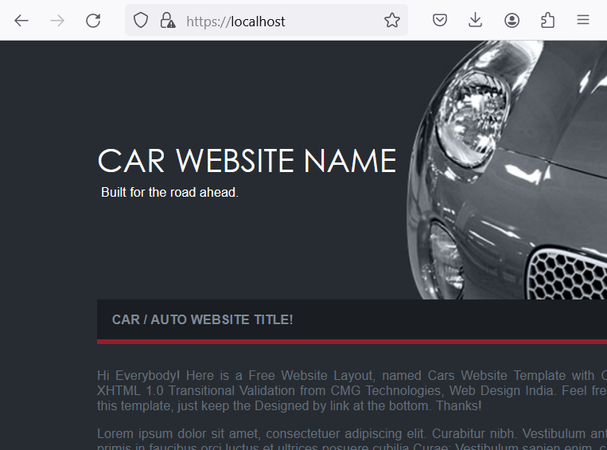
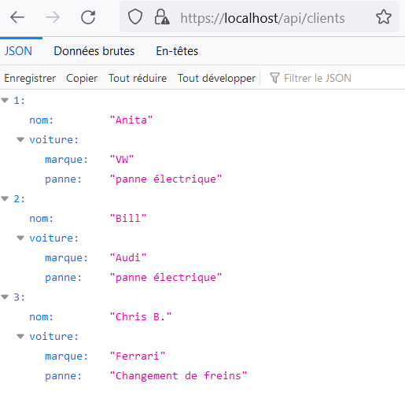
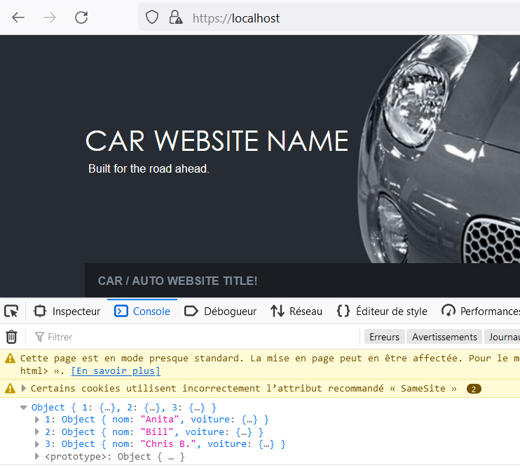

# Lab5HTTPinfra

## 1. Static Web site
Pour cette partie du projet le but était de construire un docker qui contient un serveur HTTP statique Nginx.

- J'ai commencé par récupérer sur Free-CSS un template d'une page web.
- Ensuite, j'ai créé le dossier staticWebSite où je stockerai cette partie du projet.
- J'ai créé un fichier Dockerfile sans extension à l'aide de la commande suivante :
```
type nul > Dockerfile
```

- Puis j'ai ensuite ajouté ceci dans mon Dockerfile:
```
FROM nginx:latest

COPY ./html /usr/share/nginx/html
```

FROM nginx:latest indique que cette image Docker doit être basée sur l'image officielle "nginx". 
nginx:latest spécifie que la dernière version disponible de l'image nginx doit être utilisée comme point de départ.

COPY ./html /usr/share/nginx/html, copie le contenu du répertoire local ./html vers le répertoire /usr/share/nginx/html à l'intérieur de l'image Docker.
Cette ligne est utilisée pour inclure les fichiers HTML, CSS, JavaScript, etc., nécessaires pour le serveur web Nginx.

- Il faut ensuite lancer la commande docker build avec le nom du serveur que vous voulez. J'ai choisi de le nommer webserver.
```
docker build -t webserver . 
```

- Il faut créer un fichier nginx.conf qui contient les configurations pour le serveur web nginx.
```
http {

  access_log /var/log/nginx/access.log ;
  error_log /var/log/nginx/error.log;

  sendfile     on;
  tcp_nopush   on;

  server {
    listen       80;
    server_name  localhost;
    root         html;

    location / {
      root /usr/share/nginx/html;
      index index.html;
    }
  }

}
```

- acces_log et error_log permet de définir où écrire le journal d'accès et le journal des erreurs.
Sendfile et tcp_nopush permettent d'optimiser les performances.
- sendfile élimine l'étape de copier les données dans la mémoire tampon et permet de recopier directement des données d'un descripteur de fichier à un autre.
- tcp_nopush cela permet à NGINX d'envoyer des en-têtes de réponse HTTP dans un paquet juste après que le fragment de données a été obtenu par sendfile().
- Ensuite dans le block server, on ajoute le listen pour définir le port sur lequel le serveur écoute. Server_name définit le nom de domaine. 
Root définit le répertoire racine.
- On a aussi dans un serveur le block location / qui définit les chemins si on se trouve dans la page d'accueil.


- Il est ensuite possible de lancer le serveur avec la commande suivante :

```
docker run -p 8080:80 webserver
```
- Une fois le serveur lancé, essayer d'accéder à la page web en copiant l'URL suivant dans le navigateur.

http://localhost:8080/


## 2. Docker Compose

Pour cette partie, il fallait créer un docker compose avec le serveur web static créer précèdemment.

- J'ai tout d'abords créer un fichier docker-compose.yml.

```
services:
  webapp:
    build: ./staticWebSite/
```
À l'intérieur de ce fichier, j'ai ajouté un service que j'ai nommé webapp puis dans le build, je donne le chemin du Dockerfile 
de mon serveur web static.

- Il suffit de lancer la commande de compilation depuis le répertoire où se trouve le docker-compose.yml.

```
docker compose build
```

Puis une fois cette commande executée, on peut lancer le docker-compose en arrière-plan en exécutant la commande suivante.

```
docker compose up -d
```

- Vérifier que le serveur web est bien lancé en visitant comme précédemment le lien suivant :

http://localhost:8080/


Pour arrêter le docker compose il suffit de lancer ceci:
```
docker compose down
```

## 3. HTTP API Server

Le but de cette partie est de créer une API qui supporte opérations CRUD.

Pour ce faire, j'ai décidé de faire une liste de personnes avec leurs voitures et la panne associée. Cette liste 
permettrait par exemple à un mécanicien de s'organiser en sachant le nombre de clients qui attendent un dépannage.

Dans mon projet, j'ai 4 classes Main, ClientController, Client et Voiture.

J'ai donc un fichier Main qui créé une application Javalin sur le port 7777 crée un ClientController afin de définir les routes.

Ensuite, j'ai un fichier ClientController, qui permet de gérer les opérations CRUD.

J'ai la classe Client qui permet de créer un Client avec un nom et une voiture.

Puis pour finir la classe Voiture qui permet de créer une voiture contenant une marque et une panne.

Il fallait, ensuite pouvoir le lancer depuis le docker-compose. Pour réussir, j'ai créé un Dockerfile.

```
FROM alpine:latest
RUN apk add --no-cache openjdk21
WORKDIR /HTTP-API
COPY target/app.jar /app.jar
# This is the port that your javalin application will listen on
EXPOSE 7777
ENTRYPOINT ["java", "-jar", "/app.jar"]
```
Dans le FROM j'ai utilisé alpine:latest ce qui signifie que j'utilise une image Alpine Linux la plus récente.
RUN me permet d'installer OpenJDK version21 sur l'image Alpine.
WORKDIR définit le répertoire de travail.
COPY permet de copier le fichier jar dans le bon répertoire de l'image.
EXPOSE 7777 indique le port sur lequel l'application javalin écoute.
Pour finir ENTRYPOINT permet de définir la commande à exécuter lorsque le conteneur est exécuté.

Pour tester mon application, j'ai utilisé Bruno.

Voici les tests effectués:
- Tout d'abords on lance le docker compose.


- Au début du programme, je crée automatiquement 3 clients. En effectuant un getAll on peut donc voir ceci.


- Il est également possible de récupérer un seul client, ici je récupère le client avec l'id 2.


- On peut ajouter un client avec le post. 


- On peut mettre à jour le client avec l'update, ici on met à jour le client qu'on vient d'ajouter donc l'id 4.  


- J'ai fait un deuxième post, puis on fait un getAll afin de comparer le post initial et l'update. On peut
voir que le client avec l'id 4 a été modifié. On peut voir le client avec l'id 5 correspond au client post sans update.


- Si on souhaite à présent supprimer le client avec l'id 5 il est également possible avec delete.


- On vérifie avec le getAll que le client a bien été supprimé.


## 4. Reverse Proxy avec Trafik

Le but de cette partie est de placer un reverse proxy devant le serveur web statique et le serveur web dynamique. 
Le reverse proxy pourra ainsi recevoir toutes les connexions et les transmettre au bon serveur.

On va utiliser Traefik comme reverse proxy.

D'abords, on charge Traefik avec la commande suivante :

```
docker pull traefik
```

Il faut ensuite modifier le fichier docker-compose.yml.
Il faut ajouter le service du reverse proxy.
Il faut également ajouter les labels pour le service webapp et http-api. Il faut activer le service traefik et définir la route.
Voici ci-dessous les lignes ajoutées : 
```
services:
 webapp:
  labels:
   - "traefik.enable=true"
   - "traefik.http.routers.web.rule=Host(`localhost`)"

 http-api:
  labels:
   - "traefik.enable=true"
   - "traefik.http.routers.api.rule=Host(`localhost`) && PathPrefix(`/api`)"

 reverse-proxy:
# The official v2 Traefik docker image
  image: traefik:v2.10
# Enables the web UI and tells Traefik to listen to docker
  command: --api.insecure=true --providers.docker
  ports:
# The HTTP port
   - "80:80"
# The Web UI (enabled by --api.insecure=true)
   - "8080:8080"
  volumes:
# So that Traefik can listen to the Docker events
   - /var/run/docker.sock:/var/run/docker.sock
```
Pour accéder au dashboard, il faut utiliser le lien suivant :

http://localhost:8080/dashboard/#/

Pour accéder au serveur web statique utiliser le lien suivant :

http://localhost:80

Pour accéder à l'api utiliser le lien suivant :

http://localhost/api

## 5. Scalability et load balancing

L'objectif de cette section est de permettre à Traefik de détecter dynamiquement plusieurs instances de 
serveurs Web (dynamiques/statiques).

Il faut rajouter dans le fichier docker-compose.yml les deux lignes suivantes pour chaque service. Ici dans mon cas je l'ai ajoutée
pour webapp et http-api.
```
deploy:
 replicas: 3
```

On peut lancer le docker compose. Comme j'ai mis une valeur de 3 dans les replicas 3 container de chaque service sont lancés.
Il est possible de modifier le nombre de serveur lancés sans devoir modifier le fichier docker-compose. Il suffit d'utiliser la commande 
suivante :
```
docker-compose up --scale webapp=4 --scale http-api=5 -d
```
Ici j'ai décidé de lancer 4 webapp et 5 http-api. Vous pouvez évidement remplacer ces valeurs par celles dont vous avez besoin. 
Ci-dessous on peut voir que comme trois services de chaque était déjà lancé, il a uniquement démarré un nouveau webapp pour respecter
les 4 webapp demandé et 2 nouveaux http-api afin de respecter les 5 demandés.


Il est également possible de diminuer le nombre de services, comme on peut le voir dans la commande ci-dessous


On peut également vérifier sur Traefik le nombre de services lancés. Voici ci-dessous le lien et la capture.
```
http://localhost:8080/dashboard/#/http/services
```


## 6. Load balancing with round-robin and sticky sessions

Pour ajouter les cookies, il suffit d'ajouter ces deux lignes dans le service http-api, sous label.
```
- "traefik.http.services.api.loadbalancer.sticky.cookie=true"
- "traefik.http.services.api.loadbalancer.sticky.cookie.name=cookieapi"
```




Pour vérifier le Round-Robin avec le webapp, on lance cette page.
http://localhost/api/clients
Puis on lance la commande 
```
docker-compose logs -f webapp
```



## 7. Securing Traefik with HTTPS

Tout d'abords, il faut installer OpenSSL. 
Il est ensuite possible grâce à OpenSSL de créer un certificat et une clé.
Voici la commande :
```
openssl req -x509 -newkey rsa:4096 -keyout key.pem -out cert.pem -sha256 -days 365
```

Quelques informations sont demandées, une fois la clé et le certificat créés, il faut créer un fichier traefik.yaml.
Puis voici ce que j'y ai ajouté :
```
providers:
  docker: {}

entryPoints:
  web:
    address: ":80"

  websecure:
    address: ":443"

tls:
  certificates:
    - certFile: /certificats/cert.pem
      keyFile: /certificats/key.pem

api:
  dashboard: true
  insecure: true
```

Suite à ça, il faut compléter le fichier docker-compos.yml. Pour ce faire il y a deux lignes à ajouter par service.
Sous http-api, label
```
- "traefik.http.routers.api.tls=true"
- "traefik.http.routers.api.entrypoints=web,websecure"
```

Sous webapp, label
```
- "traefik.http.routers.web.tls=true"
- "traefik.http.routers.web.entrypoints=web,websecure"
```

Il est ensuite possible d'utiliser HTTPS pour les deux services.
Pour tester, il suffit de cliquer sur les deux liens suivants :

- Lien webapp
https://localhost/



- Lien http-api
https://localhost/api/clients



## Optional 2: Integration API - static Web site

J'ai commencé par créer un fichier script.js dans le même répertoire que mon fichier index.html
J'ai essayé de réaliser le code le plus simple possible permettant de récupérer les données et les afficher sur la page web
plus exactement dans la console de la page. Pour ce faire j'ai utilisé le code suivant :
```
// script.js

// Fonction asynchrone pour récupérer et afficher les clients
async function logClients() {
try {
// Effectuer une requête Fetch vers l'URL des clients
const response = await fetch("https://localhost/api/clients");

        // Vérifier si la requête a réussi (statut HTTP 200)
        if (!response.ok) {
            throw new Error(`Erreur HTTP! Statut: ${response.status}`);
        }

        // Convertir la réponse en format JSON
        const clients = await response.json();

        // Afficher les clients dans la console
        console.log(clients);
    } catch (error) {
        // Gérer les erreurs de manière appropriée
        console.error("Erreur lors de la récupération des clients:", error);
    }
}

// Appeler la fonction pour récupérer et afficher les clients
logClients();
```

Après cela, j'ai ajouté dans l'entête du fichier html le chemin du fichier script
comme ceci : 
```
<script src="script.js"></script>
```
Pour tester le fonctionnement, j'ai ouvert la page web static. 
Puis en faisant clic droit sur la page, sélectionner l'option Inspecter. Choisissez ensuite la console.
https://localhost/
